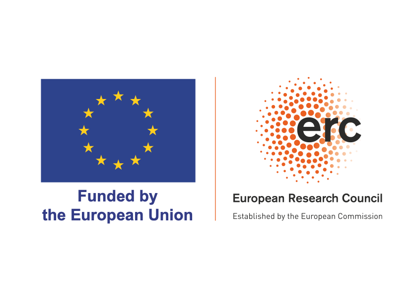

# Summary

`seesus` is an open-source Python package that evaluates whether a textual expression aligns with the concept of sustainability as defined by the United Nations Sustainable Development Goals (SDGs). It labels a statement with the 17 SDGs as well as 169 specific targets and categorizes the statement into social, environmental, or economic sustainability. Compared to existing SDG classification software in Python, `seesus` is the only one that is tuned to a finer scale – the SDG target level – and offers transparency and controllability, allowing users to examine and customize the syntax of text classification according to their needs.

# Statement of need

Sustainability is an important topic in contemporary discourse. However, the delineation and interpretation of this concept are often different across disciplines [@Salas-Zapata_Ríos-Osorio_Cardona-Arias_2017], which hinders effective communication, causes inconsistencies in research and practice, and impedes measurable actions to achieve sustainability [@Waseem_Kota_2017; @Yamada_Kanoi_Koh_Lim_Dove_2022]. With the increasing popularity of text-based assessments [@Amini_Bienstock_Narcum_2018; @Olsen_Fenhann_2008; @Singh_Meena_Khandelwal_Dangayach_2023], these issues have become more prominent, as the criteria vary for evaluating sustainability commitments and contributions.

`seesus`, based on the United Nations (UN) Sustainable Development Goals (SDGs), addresses the critical need in text analysis to capture the concept of sustainability with a rigorous and credible definition. The SDGs provide an international framework and a shared understanding of what it means to be sustainable, balancing the environmental, economic, and social dimensions of sustainability [@UN_2015]. `seesus` identifies expressions regarding achieving the 17 SDGs and their associated 169 targets within a text and labels whether the expressions pertain to social, environmental, or economic sustainability. Unlike other SDG text-mining packages, it is designed to identify not only terms related to the SDGs but also the attainment of SDGs.

`seesus` achieves an accuracy rate of 75.5%, as determined by alignment with manual coding. Detailed information on the accuracy evaluation and manual refinement can be found in `SDGdetector` [@Li_Frans_Song_Cai_Zhang_Liu_2023], our R package employing the same matching logic as `seesus`. In an era of large language models, `seesus` chooses to use predefined regular expression patterns instead of machine learning for text classification, because this method is more transparent, replicable, and controllable. Users of `seesus` can examine the matching logic and customize the syntax if necessary. In addition, compared to other text classifiers based on the SDGs in Python, including `SDG-Classifier` [@Rawat_2022], `SDG Auto Labeller` [@Glass_2020], `UN-SDG-Classifier` [@Lamichaney_2021], `EUR-SDG-Mapper` [@Jelicic_van_der_Vorst_Ranjbar_Mijnhardt_2022], `seesus` is the only one that covers all the SDGs and is fine-tuned to the target level.

Given the interdisciplinary nature of the sustainability concept, the usage of this package is not confined to a specific scientific context. It has a wide application in research based on text analysis across various domains. For example, sustainability scientists can use `seesus` to label academic publications to quantify which dimension of sustainability receives the most attention. Policy analysts can utilize `seesus` to conduct large-scale scans of planning documents to assess efforts toward urban sustainability and track the changes over time. Scholars in business research engaged in environmental, social, and governance reporting can employ `seesus` to evaluate the alignment of corporate messaging with the SDGs. In K12 education, teachers and students can use this tool to delve into community sustainability studies. Individuals who are actively engaged in civic participation may leverage this tool to examine local sustainability plans and efforts. In addition, `seesus` can be used in combination with translation software to support text analysis in languages other than English.

# Functionality

`seesus` currently has four main functions: (1) evaluating whether a statement aligns with the concept of sustainability; (2) identifying SDGs and associated targets in a statement; (3) classifying a statement into social, environmental, and economic sustainability; (4) examining and customizing match syntax.

# Acknowledgements

Funded by the European Union (ERC, scAInce, 101087218). Views and opinions expressed are however those of the author(s) only and do not necessarily reflect those of the European Union or the European Research Council Executive Agency. Neither the European Union nor the granting authority can be held responsible for them. MC was supported by the Michigan State University Dissertation Completion Fellowship. VFF was supported by the National Science Foundation Graduate Research Fellowship Program (Fellow ID: 2018253044) and the Michigan State University Enrichment Fellowship.

{ width=20% }

# References
